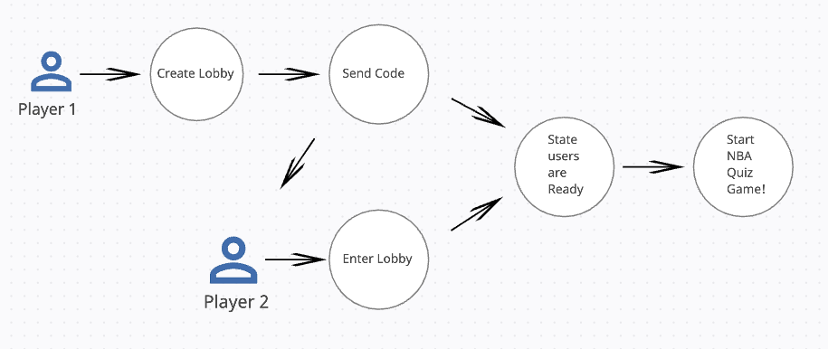
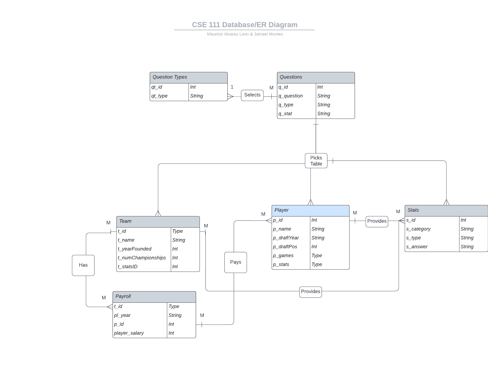

# NBA Brain Jam - CSE-111-Project

Instructions to Run Flask App
========
In root directory, run: 

1. `source brainjam_env/bin/activate`
2. `export FLASK_APP=brainjam/app`
3. `flask run`

Use Case Diagram - Starting Game
------------

Use Case Diagram - Playing Game
------------

ER & Schema Diagram
------------

